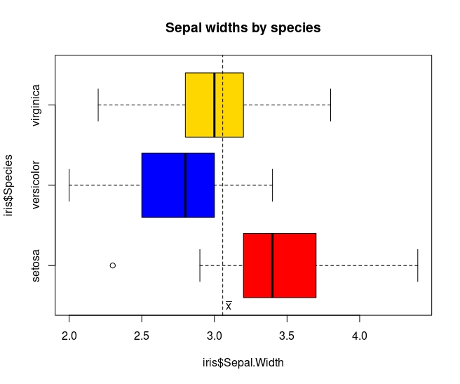

# Data Visualization

### Base R Graphics

#### Fatih Emre Ozturk

## Aim of the Project

Data visualization can be defined as the use of graphical or pictorial representations to present data in a way that makes it easier to understand, analyze, and communicate. It involves the use of visual elements such as charts, graphs, and maps to help users better understand and interpret complex data sets. Data visualization is an important tool for exploratory data analysis, as well as for communicating results to others. By presenting data in a visual format, data visualization can also help to reveal new connections and insights that might not be apparent from a purely numerical or textual analysis. Effective data visualization allows viewers to quickly identify patterns, trends, and relationships within the data, and can be used to highlight key insights or communicate complex ideas. In this project, I will explain the details that need to be considered when plotting with base R `graphics`.

In base R, there are many functions that can be used to create different types of plots.Although there is no clear distinction between high-level and low-level functions, I like to divide functions as such. I believe that there are some functions which can be called as high-level plotting functions tend to provide a convenient way to create a specific type of plot with a relatively small amount of code. On the other hand, there are some functions which can be called as low-level plotting functions provide more control and flexibility, but require more coding to create a plot. At this point, it needs to be noted that the package `ggplot2`, which will be explained later in another project, is built around the concept of "grammar of graphics", which means that it provides a set of rules for building plots by combining basic building blocks or components. It is possible to think low-level functions as components in the `ggplot2` package.

There are five high-level plotting functions in the base R. There functions can be listed as follows:

1.  [barplot()](https://www.rdocumentation.org/packages/graphics/versions/3.6.2/topics/barplot)

2.  [pie()](https://www.rdocumentation.org/packages/graphics/versions/3.6.2/topics/pie)

3.  [hist()](https://www.rdocumentation.org/packages/graphics/versions/3.6.2/topics/hist)

4.  [boxplot()](https://www.rdocumentation.org/packages/graphics/versions/3.6.2/topics/boxplot)

5.  [plot()](https://www.rdocumentation.org/packages/graphics/versions/3.6.2/topics/plot)

There are seven low-level plotting functions in the base R. There functions can be listed as follows:

1.  [text()](https://www.rdocumentation.org/packages/graphics/versions/3.6.2/topics/text) : A function to draw the strings given in the vector **`labels`** at the coordinates

2.  [points()](https://www.rdocumentation.org/packages/graphics/versions/3.6.2/topics/points): A generic function to draw a sequence of points at the specified coordinates

3.  [lines()](https://www.rdocumentation.org/packages/graphics/versions/3.6.2/topics/lines) : A generic function taking coordinates given in various ways and joining the corresponding points with line segments.

4.  [legend()](https://www.rdocumentation.org/packages/graphics/versions/3.6.2/topics/legend) : A function to add legends to plots.

5.  [abline()](https://www.rdocumentation.org/packages/graphics/versions/3.6.2/topics/abline) : A function to add one or more straight lines through the current plot.

6.  [arrows()](https://www.rdocumentation.org/packages/graphics/versions/3.6.2/topics/arrows) : A function to draw arrows between pairs of points.

7.  [symbols()](https://www.rdocumentation.org/packages/graphics/versions/3.6.2/topics/symbols) : A function to draw symbols on a plot

I think there is one thing that should be mentioned at this point. High-level plotting functions can create a plot by themselves, while low-level plotting functions must have a high-level function in order to work. While showing each high-level function, I tried to explain the working logic of these two types of functions by adding one or more low-level functions.

## Barplot

Barplot is used to create bar charts, which are a type of graph that displays categorical data as rectangular bars with heights or lengths proportional to the values they represent. By looking at the relative heights or lengths of the bars, it might be possible to quickly compare the values and identify any trends or patterns. The barplot() function in base R has several arguments that can be used to customize the appearance and behavior of the resulting bar chart.

The basic barplot looks like the following:

Here how it looks like if I add some of the arguments:

## Piechart

A pie chart is a type of circular graph that is commonly used to represent data as a set of slices, where each slice corresponds to a category and its area or angle represents the proportion of that category relative to the whole. The total area or angle of the pie represents the total value of the data being displayed. The pie() function in R is used to create a pie chart.

The basic pieplot looks like the following:

## Histogram

A histogram is a graphical representation of the distribution of a dataset. It is a type of bar plot that represents the frequency or count of values that fall within a set of intervals or "bins". The x-axis represents the intervals or bins of values, while the y-axis represents the frequency or count of values that fall within each interval. Bin width is an important detail that has been widely studied in the literature and is still debated. This is because deciding the number and width of the bins in a histogram can have a significant impact on the resulting visualization.

Here how basic histogram looks like with default bin width:

If I change breaks as follows, it will look like this:

Assuming that I wanted to analyse this histogram to have an idea about the distribution of the mpg variable, I would have different ideas about the distribution of the mpg variable for both graphs.

For this reason, there are several methods for determining the appropriate number of bins, including:

-   [Sturges' formula](https://www.tandfonline.com/doi/abs/10.1080/01621459.1926.10502161) uses the following formula to determine the number of bins: k = 1 + log2(n), where k is the number of bins and n is the number of data points.

-   [Freedman-Diaconis rule](https://link.springer.com/article/10.1007/BF01025868) uses the interquartile range (IQR) to determine the width of each bin. The formula for the bin width is: bin width = 2 \* IQR / (n\^(1/3)), where n is the number of data points.

-   [Scott's rule](https://academic.oup.com/biomet/article-abstract/66/3/605/232642?redirectedFrom=fulltext) uses the standard deviation of the data to determine the width of each bin. The formula for the bin width is: bin width = 3.5 \* sd / (n\^(1/3)), where sd is the standard deviation of the data and n is the number of data points.

## Boxplot

A boxplot is a graphical representation of the distribution of a dataset. It is a standardized way of displaying the distribution of data based on five summary statistics: the minimum value, the first quartile (Q1), the median, the third quartile (Q3), and the maximum value.

Here how basic boxplot looks like:

Here how it looks like if I add some of the arguments:

## Plot

In base R, it is possible to draw both line and scatterplot with the plot() function. A scatter plot is a type of graph that displays the relationship between two continuous variables. Each point on the plot represents a single observation, with the x-axis representing the values of one variable and the y-axis representing the values of the other variable. A line plot is a graph that displays data points connected by straight lines. The x-axis represents the independent variable, and the y-axis represents the dependent variable.

Here is one example of scatterplot with `plot()` function:

Here is one example of line plot with `plot()` function:

Also it is possible to draw the plots like this:

## Par Function

The par() function is a built-in function in R that is used to set or retrieve graphical parameters. These parameters control the appearance of the graphics such as the size of the plotting region, the margins, the axes, the color, and more.

Here is an example of par function:

## Useful Resources

-   [R Graph Gallery](https://r-graph-gallery.com/index.html)

-   [R Software Handbook](https://bookdown.org/aschmi11/RESMHandbook/data-visualization-in-base-r.html)

-   [Analytics Vidhya](https://www.analyticsvidhya.com/blog/2015/07/guide-data-visualization-r/)

-   [Data Carpentry](https://datacarpentry.org/R-genomics/05-data-visualization.html)
